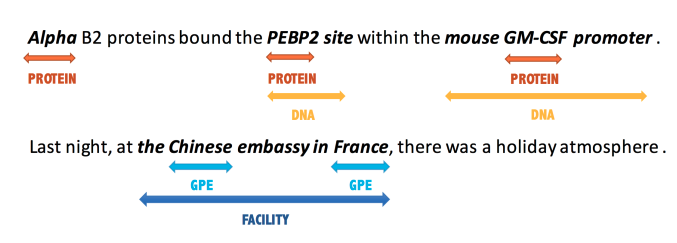
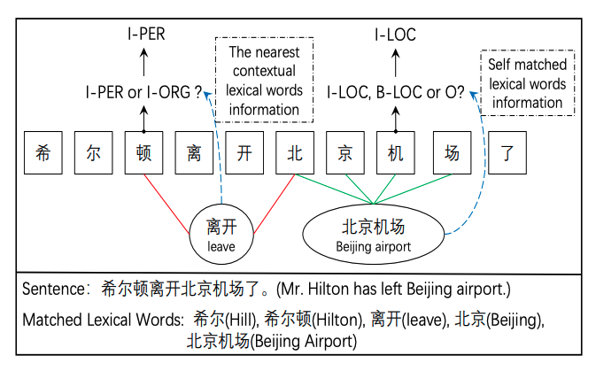
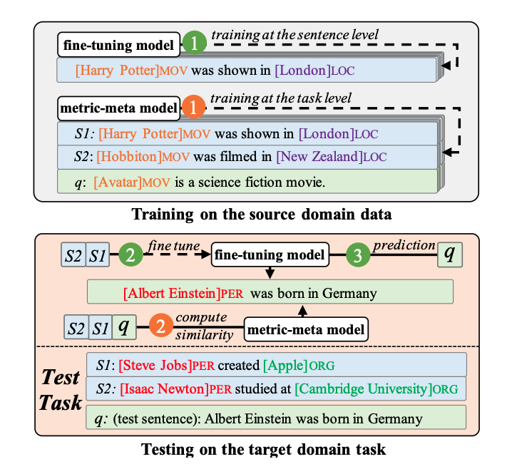
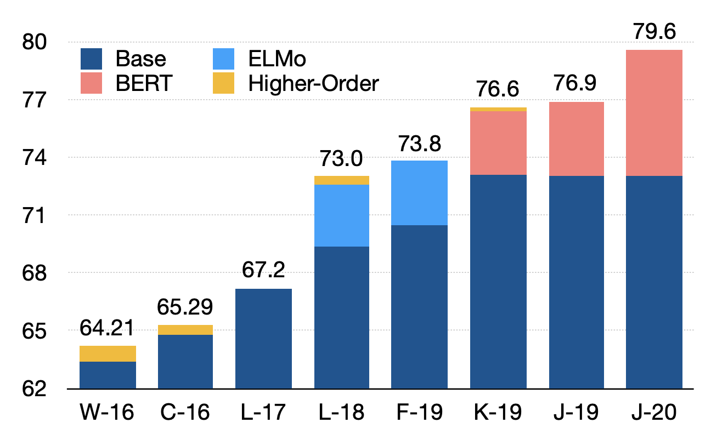

# Make-Information-Extraction-Great-Again

**Welcome to contribute!!!**

Contributor: [Runxin Xu](https://github.com/RunxinXu), [Shuang Zeng](https://github.com/DreamInvoker)

And thank [Yuxuan Fan](https://github.com/feiba54), [Yifan Song](https://github.com/Yifan-Song793) for their suggestions!

Content
* [Named Entity Recognition](#named-entity-recognition)
* [Coreference Resolution](#coreference-resolution)
* [Relation Extraction](#relation-extraction)
* [Event Extraction](#event-extraction)
* [Joint Information Extraction](#joint-information-extraction)

## Named Entity Recognition

* [Supervised Sentence-level Named Entity Recognition](#supervised-sentence-level-named-entity-recognition)
* [Chinese Named Entity Recognition](#chinese-named-entity-recognition)
* [Few-shot Named Entity Recognition](#few-shot-named-entity-recognition)
* [Document-level Named Entity Recognition](#document-level-named-entity-recognition)

- Survey
  - [A Survey on Deep Learning for Named Entity Recognition](https://ieeexplore.ieee.org/document/9039685) (TKDE2020): 2020
  - [A Survey on Recent Advances in Named Entity Recognition from Deep Learning models](https://aclanthology.org/C18-1182/) (COLING2018): 2018
  - [A survey of named entity recognition and classification](https://nlp.cs.nyu.edu/sekine/papers/li07.pdf) (NYU): 2017

### Supervised Sentence-level Named Entity Recognition

#### What is it?

Given a sentence, the task aims at recognizing the entities and their entity types in the sentence. 
For example, *Alpha* is an *Protein* type entity in the figure.

#### What are the challenges?

- How to handle the nested entities?
- How to handle the discontinuous entities?

#### Mainstream methods?

- Sequence Labeling
  - [End-to-end Sequence Labeling via Bi-directional LSTM-CNNs-CRF](https://aclanthology.org/P16-1101/) (ACL2016)
  - [A Neural Layered Model for Nested Named Entity Recognition](https://aclanthology.org/N18-1131/) (NAACL2018): stack多层来从内到外识别实体
  - [Sequence-to-Nuggets: Nested Entity Mention Detection via Anchor-Region Networks](https://aclanthology.org/P19-1511/) (ACL2019): 先找anchor word再向两边扩展
  - [TENER: Adapting Transformer Encoder for Named Entity Recognition](https://arxiv.org/abs/1911.04474) (arXiv): 改进position embedding
  - [Nested Named Entity Recognition with Partially-Observed TreeCRFs](https://www.aaai.org/AAAI21Papers/AAAI-6725.FuY.pdf) (AAAI2021): TreeCRF
- Span-level
  - [A Local Detection Approach for Named Entity Recognition and Mention Detection](https://aclanthology.org/P17-1114/) (ACL2017)
  - [A Boundary-aware Neural Model for Nested Named Entity Recognition](https://aclanthology.org/D19-1034/) (EMNLP2019): 先判断哪些token可以作为entity的开头结尾，然后遍历判断所有potential spans
  - [Multi-Grained Named Entity Recognition](https://aclanthology.org/P19-1138/) (ACL2019): word-level+sentence-level特征先找possible spans再分类
  - [Named Entity Recognition as Dependency Parsing](https://aclanthology.org/2020.acl-main.577/) (ACL2020)
  - [Pyramid: A Layered Model for Nested Named Entity Recognition](https://aclanthology.org/2020.acl-main.525/) (ACL2020): Pyramid
  - [Boundary Enhanced Neural Span Classification for Nested Named Entity Recognition](https://ojs.aaai.org/index.php/AAAI/article/view/6434) (AAAI2020): 同时分类boundary label和span label
  - [SpanNER: Named Entity Re-/Recognition as Span Prediction](https://aclanthology.org/2021.acl-long.558/) (ACL2021)
- Hypergraph-based
  - [Joint Mention Extraction and Classification with Mention Hypergraphs](https://aclanthology.org/D15-1102/) (EMNLP2015)
  - [Nested Named Entity Recognition Revisited](https://aclanthology.org/N18-1079/) (NAACL2018): 将序列构建成一个hypergraph
  - [Neural Segmental Hypergraphs for Overlapping Mention Recognition](https://aclanthology.org/D18-1019/) (EMNLP2018): hypergraph-based
- MRC
  - [A Unified MRC Framework for Named Entity Recognition](https://aclanthology.org/2020.acl-main.519/) (ACL2020)
  - [Coarse-to-Fine Pre-training for Named Entity Recognition](https://aclanthology.org/2020.emnlp-main.514/) (EMNLP2020): 基于MRC-NER框架做pre-trainning
- Transition-based
  - [A Neural Transition-based Model for Nested Mention Recognition](https://aclanthology.org/D18-1124/) (EMNLP2018)
  - [An Effective Transition-based Model for Discontinuous NER](https://aclanthology.org/2020.acl-main.520/) (ACL2020): seq2seq
- Sequence to Sequence
  - [Learning to Progressively Recognize New Name](https://aclanthology.org/C18-1185/) (COLING2018)
  - [SC-NER: A Sequence-to-Sequence Model with Sentence Classification for Named Entity Recognition](https://link.springer.com/chapter/10.1007%2F978-3-030-16148-4_16) (PAKDD2019)
  - [Neural Architectures for Nested NER through Linearization](https://aclanthology.org/P19-1527/) (ACL2019)
  - [A Unified Generative Framework for Various NER Subtasks](https://aclanthology.org/2021.acl-long.451/) (ACL2021)

#### Datasets?

- CoNLL-2002: [Introduction to the CoNLL-2002 Shared Task: Language-Independent Named Entity Recognition](https://aclanthology.org/W02-2024/)
- CoNLL-2003: [Introduction to the CoNLL-2003 Shared Task: Language-Independent Named Entity Recognition](https://aclanthology.org/W03-0419/)
- OntoNotes: [Towards Robust Linguistic Analysis using OntoNotes](https://aclanthology.org/W13-3516/)
- ACE04: [Website](http://www.lrec-conf.org/proceedings/lrec2004/summaries/5.htm)
- ACE05: [Website](https://books.google.com/books?id=SbjjuQEACAAJ)
- WNUT-2016: [Results of the WNUT16 Named Entity Recognition Shared Task](https://aclanthology.org/W16-3919/)
- WNUT-2017: [Results of the WNUT2017 Shared Task on Novel and Emerging Entity Recognition](https://aclanthology.org/W17-4418/)
- Genia: [GENIA Corpus - A Semantically Annotated Corpus For Bio-textmining](https://academic.oup.com/bioinformatics/article/19/suppl_1/i180/227927)
- CADEC: [Cadec: A corpus of adverse drug event annotations](https://www.sciencedirect.com/science/article/pii/S1532046415000532?via%3Dihub)
- ShARe13: [Task 1: ShARe/CLEF eHealth Evaluation Lab 2013](http://ceur-ws.org/Vol-1179/CLEF2013wn-CLEFeHealth-PradhanEt2013.pdf)
- ShARe14: [Task 2: ShARe/CLEF eHealth Evaluation Lab 2014](http://ceur-ws.org/Vol-1180/CLEF2014wn-eHealth-MoweryEt2014.pdf)

### Chinese Named Entity Recognition

#### What is it?

Different from English sentence, Chinese sentence features different sttructure of characters and words, and does not has explicity word boundary, which makes it more challenging.

#### What are the challenges?

- How to better utilize the character-word lattice structure to enhance Chinese NER?
- How to accelerate the model so that we can fully utilize the parallel computation of GPUs with a high inference speed?

#### Mainstream methods?

- Model Architecture
  - [Chinese NER Using Lattice LSTM](https://aclanthology.org/P18-1144/) (ACL2018): Lattice LSTM
  - [CNN-Based Chinese NER with Lexicon Rethinking](https://www.ijcai.org/proceedings/2019/692) (IJCAI2019): CNN + n-gram金字塔
  - [Leverage Lexical Knowledge for Chinese Named Entity Recognition via Collaborative Graph Network](https://aclanthology.org/D19-1396/) (EMNLP2019): Graph
  - [A Lexicon-Based Graph Neural Network for Chinese NER](https://aclanthology.org/D19-1096/) (EMNLP2019): Graph
  - [Porous Lattice Transformer Encoder for Chinese NER](https://aclanthology.org/2020.coling-main.340/) (COLING2020): 改进attention
  - [FLAT: Chinese NER Using Flat-Lattice Transformer](https://aclanthology.org/2020.acl-main.611/) 
  (ACL2020): flat structure
  - [Entity Enhanced BERT Pre-training for Chinese NER](https://aclanthology.org/2020.emnlp-main.518/) (EMNLP2020): 利用entity信息
  - [Lattice-BERT: Leveraging Multi-Granularity Representations in Chinese Pre-trained Language Models](https://aclanthology.org/2021.naacl-main.137/) (NAACL2021): 多粒度的针对中文NER的BERT预训练
- Enhanced Embedding
  - [An Encoding Strategy Based Word-Character LSTM for Chinese NER](https://aclanthology.org/N19-1247/) (NAACL2019): 除了character embedding之外还引入对应的word embedding
  - [A Neural Multi-digraph Model for Chinese NER with Gazetteers](https://aclanthology.org/P19-1141/) (ACL2019): 引入外部entity词典信息
  - [Simplify the Usage of Lexicon in Chinese NER](https://aclanthology.org/2020.acl-main.528/) (ACL2020)

#### Datasets?

- Ontonotes 4.0: [Website](https://catalog.ldc.upenn.edu/LDC2013T19)
- MSRA: [The Third International Chinese Language Processing Bakeoff: Word Segmentation and Named Entity Recognition](https://aclanthology.org/W06-0115/)
- Resume: [Chinese NER Using Lattice LSTM](https://aclanthology.org/P18-1144/)
- Weibo: [Named Entity Recognition for Chinese Social Media with Jointly Trained Embeddings](https://aclanthology.org/D15-1064/)
- CLUENER-2020: [CLUENER2020: Fine-grained Named Entity Recognition Dataset and Benchmark for Chinese](https://arxiv.org/abs/2001.04351)

### Few-shot Named Entity Recognition

#### What is it?

The few-shot NER problem is usually modeled as a N-way-K-shot task following traditional meta-learning paradigm. 

#### What are the challenges?

- How to precisely capture the characteristics of different entity types given few training data?
- How to handle the imbalance of entity types (the domination of *O* class)?

#### Mainstream methods?

- Meta-learning
  - Prototype Network
    - [Few-shot Slot Tagging with Collapsed Dependency Transfer and Label-enhanced Task-adaptive Projection Network](https://aclanthology.org/2020.acl-main.128/) (ACL2020): TapNet + Collapsed Dependency Transfer + Label Information
    - [Simple and Effective Few-Shot Named Entity Recognition with Structured Nearest Neighbor Learning](https://aclanthology.org/2020.emnlp-main.516/) (EMNLP2020): Collapsed Dependency Transfer + Nearset Neighbor
    - [Few-Shot Named Entity Recognition A Comprehensive Study](https://arxiv.org/abs/2012.14978) (arXiv): 针对entity的pre-training + self training
    - [Few-shot Intent Classification and Slot Filling with Retrieved Examples](https://aclanthology.org/2021.naacl-main.59/) (NAACL2021): Span-based
    - [An Enhanced Span-based Decomposition Method for Few-Shot Sequence Labeling](https://arxiv.org/abs/2109.13023) (arXiv): span-based + 各类attention + 对O类细分
    - [CONTaiNER: Few-Shot Named Entity Recognition via Contrastive Learning](https://arxiv.org/abs/2109.07589) (arXiv): 更复杂的距离计算函数
    - [Learning from Language Description: Low-shot Named Entity Recognition via Decomposed Framework](https://aclanthology.org/2021.findings-emnlp.139/) (EMNLP2021 findings): 对O类细分
  - MAML
    - [Few-Shot Named Entity Recognition via Meta-Learning](https://ieeexplore.ieee.org/document/9262018) (TKDE2020)
- Transfer Learning
  - [Augmented Natural Language for Generative Sequence Labeling](https://aclanthology.org/2020.emnlp-main.27/) (EMNLP2020): reformulate成Seq2Seq的方式
  - [Frustratingly simple few-shot slot tagging](https://aclanthology.org/2021.findings-acl.88/) (ACL2021 findings): reformulate成MRC的方式
  - [ConVEx Data-Efficient and Few-Shot Slot Labeling](https://aclanthology.org/2021.naacl-main.264/) (NAACL2021): 在额外reddit语料上做预训练
  - [Template-Based Named Entity Recognition Using BART](https://aclanthology.org/2021.findings-acl.161/) (ACL2021 findings): 使用template的方式遍历所有可能span和可能的entity type
  - [Template-free Prompt Tuning for Few-shot NER](https://arxiv.org/abs/2109.13532) (arXiv): 对前面template-based需要enumerate all spans的改进
  - [LightNER: A Lightweight Generative Framework with Prompt-guided Attention for Low-resource NER](https://arxiv.org/abs/2109.00720) (arXiv): BART + prompt

#### Datasets?

- SNIPS: [Snips Voice Platform: an embedded Spoken Language Understanding system for private-by-design voice interfaces](https://arxiv.org/abs/1805.10190)
- Few-NERD: [Few-NERD: A Few-shot Named Entity Recognition Dataset](https://aclanthology.org/2021.acl-long.248/)

### Document-level Named Entity Recognition

#### What is it?

Given a document that consists of multiple sentences, document-level NER aims at recognizing entities in the whole document. 

#### What are the challenges?

- How to better utilize the document-level context?
- How to maintain the consistency of entities occurring multiple times across the document?

#### Mainstream methods?

- Global Attention
  - [An attention-based BiLSTM-CRF approach to document-level chemical named entity recognition](https://pubmed.ncbi.nlm.nih.gov/29186323/) (Bioinformatics 2018): 每个句子各自encode，但是每个单词有一个attend整个document的word做一个aggregation的document-level特征
  - [Improving Clinical Named Entity Recognition with Global Neural Attention](https://link.springer.com/chapter/10.1007/978-3-319-96893-3_20) (APWeb2018)
  - [Global Attention for Name Tagging](https://aclanthology.org/K18-1009/) (CoNLL2018): 每个sentence各自encode，每个单词attend跟他一样的其他位置的词
  - [Leveraging Multi-Token Entities in Document-Level Named Entity Recognition](https://ojs.aaai.org/index.php/AAAI/article/view/6304) (AAAI2020): 引入对multi-token的entity更多地关注
  - [Named Entity Recognition in Multi-level Contexts](https://aclanthology.org/2020.aacl-main.22/) (AACL2020)
- Graph
  - [GraphIE: A Graph-Based Framework for Information Extraction](https://aclanthology.org/N19-1082/) (NAACL2019): 引入word-level graph + sentence-level graph，使用图神经网络
  - [Exploiting Global Contextual Information for Document-level Named Entity Recognition](https://arxiv.org/abs/2106.00887) (arXiv): 每个节点是一个word，相同word会有相应的边，使用图神经网络
- Global-level Memory
  - [Pooled Contextualized Embeddings for Named Entity Recognition](https://aclanthology.org/N19-1078/) (NAACL2019): 用memory维护word的global的表示
  - [Hierarchical Contextualized Representation for Named Entity Recognition](https://arxiv.org/abs/1911.02257) (AAAI2020): sentence-level representation + 基于memory的document-level representation
  - [Leveraging Document-Level Label Consistency for Named Entity Recognition](https://www.ijcai.org/proceedings/2020/550) (IJCAI2020): 先粗糙句子级别预测每个句子，然后利用整个document各个句子的初步结果使用一个uncertainty+memory的机制进行refine得到最终结果
- Concatenate (left and right) Context
  - [Fast and Accurate Entity Recognition with Iterated Dilated Convolutions](https://aclanthology.org/D17-1283/) (EMNLP2017): sentences concat起来迭代地stack dilated CNN
  - [FLERT: Document-Level Features for Named Entity Recognition](https://arxiv.org/abs/2011.06993) (arXiv)
  - [Multilingual is not enough: BERT for Finnish](https://arxiv.org/abs/1912.07076) (arXiv)
  - [Exploring Cross-sentence Contexts for Named Entity Recognition with BERT](https://aclanthology.org/2020.coling-main.78/) (CoNLL2020)
  - [A Frustratingly Easy Approach for Entity and Relation Extraction](https://aclanthology.org/2021.naacl-main.5/) (NAACL2021)

#### Datasets?

- CoNLL2003: [Introduction to the CoNLL-2003 Shared Task: Language-Independent Named Entity Recognition](https://aclanthology.org/W03-0419/)
- OntoNotes 5.0: [Website](https://catalog.ldc.upenn.edu/LDC2013T19)
- CHEMDNER: [CHEMDNER: The drugs and chemical names extraction challenge](https://jcheminf.biomedcentral.com/articles/10.1186/1758-2946-7-S1-S1)

## Coreference Resolution

- Survey
  - [Bridging Resolution: A Survey of the State of the Art](https://aclanthology.org/2020.coling-main.331.pdf) (COLING): 2020
  - [A Brief Survey and Comparative Study of Recent Development of Pronoun Coreference Resolution](https://arxiv.org/abs/2009.12721) (arxiv): 2020
  - [A Neural Entity Coreference Resolution Review](https://arxiv.org/abs/1910.09329) (arxiv): 2019
  - [Anaphora and coreference resolution: A review](https://www.sciencedirect.com/science/article/pii/S1566253519303677) (Information Fision): 2018
  - [Supervised noun phrase coreference research: The first fifteen years](https://aclanthology.org/P10-1142/) (ACL): 2020
  
### What is it?

Coreference resolution is the task of clustering mention spans in text that refer to the same underlying real world entities.

Example:

"I", "my", and "she" belong to the same cluster and "Obama" and "he" belong to the same cluster.

In this task, mention span may be named entity mention, pronoun, verb, etc.

### What are the challenges?

- How to better represent mention span?
- How to mitigate the number of enormous invalid mention spans?
- How to model contextual representation?
- How to distinguish pronoun coreference and entity coreference?

### Mainstream methods?

* [Entity Mention Resolution](#entity-mention-resolution)
* [Pronoun Resolution](#pronoun-resolution)

#### Entity Mention Resolution
- mention span pair-wise
  - [Understanding the value of features for coreference resolution](https://aclanthology.org/D08-1031.pdf) (EMNLP2008): first neural mention pair model with average perceptron model, focusing on advanced feature selection
- mention word pair-wise
  - wl-coref [Word-Level Coreference Resolution](https://paperswithcode.com/paper/word-level-coreference-resolution): consider coreference links between individual words rather than word spans and then reconstruct the word spans
- mention-antecedant ranking
  - [Learning anaphoricity and antecedent ranking features for coreference resolution](https://aclanthology.org/P15-1137/) (ACL2015): an adaption of the piece-wise scoring function via a feed-forward function
  - e2e-coref [End-to-end Neural Coreference Resolution](http://aclanthology.org/D17-1018.pdf) (EMNLP2017): span enumeration + mention pair-wise scoring (mention span score + antecedant mention span score + coreference score)
  - [Neural coreference resolution with deep biaffine attention by joint mention detection and mention clustering](https://arxiv.org/abs/1805.04893) (ACL2018): (1) using a biaffine attention model to get antecedent scores for each possible mention, and (2) jointly optimizing the mention detection accuracy and the mention clustering log-likelihood given the mention cluster labels
  - c2f-coref [Higher-order Coreference Resolution with Coarse-to-fine Inference](https://aclanthology.org/N18-2108.pdf) (NAACL2018): high-order span representation + coarse-to-fine inference
  - c2f-coref-BERT [BERT for Coreference Resolution: Baselines and Analysis](https://aclanthology.org/D19-1588/) (EMNLP2019): c2f-coref + BERT encoding
  - coref-hoi-SpanBERT+cluster_mergeing [Revealing the Myth of Higher-Order Inference in Coreference Resolution](https://arxiv.org/pdf/2009.12013v2.pdf) (EMNLP2020): analysis the impact of high-order inference (HOI) and four HOI variants
  - c2f-coref-EE [Coreference Resolution with Entity Equalization](https://aclanthology.org/2020.emnlp-main.686/) (EMNLP2020): use equalization approach represents each mention in a cluster via an approximation of the sum of all mentions in the cluster
- graph neural network
  - [Improving coreference resolution by leveraging entity-centric features with graph neural networks and second-order inference](https://arxiv.org/abs/2009.04639) (ArXiv2020): use graphs to model entities + GNN
- question answering
  - CorefQA [CorefQA: Coreference Resolution as Query-based Span Prediction](https://aclanthology.org/2020.acl-main.622/) (ACL2020): mention detection + use mention to query antecedant mention on inpu text
- cluster based
  - [Learning global features for coreference resolution](https://aclanthology.org/N16-1114/) (NAACL2016): global scoring function between the cluster assigned to each possible antecedent and the mention + local scoring function of the mention and each possible antecedent
  - [Improving coreference resolution by learning entity-level distributed representations](https://aclanthology.org/P16-1061/) (ACL2016):  define each mention as a single entity cluster and combine them during inference
- Latent-Structure models
  - c2f-coref [Higher-order Coreference Resolution with Coarse-to-fine Inference](https://aclanthology.org/N18-2108.pdf) (NAACL2018): high-order span representation + coarse-to-fine inference
- others  
  - [Improving generalization in coreference resolution via adversarial training](https://aclanthology.org/S19-1021/) (SEM2019): use adversarial gradient-based training to retrain e2e-coref
  - [Rewarding coreference resolvers for being consistent with world knowledge](https://aclanthology.org/D19-1118v2.pdf) (EMNLP2019): makes use of Relation Extraction systems and the “distill” multi-task reinforcement learning technique to fuse world knowledge into CR

#### Pronoun Resolution
- [Incorporating context and external knowledge for pronoun coreference resolution](https://aclanthology.org/N19-1093/) (NAACL2019): incorporate contextual information and external knowledge to represent pronominal expression
- [Knowledge-aware pronoun coreference resolution](https://aclanthology.org/P19-1083/) (ACL2019): leverage different types of knowledge in the format of triplet to better resolve pronoun coreference with a neural model
- [Resolving gendered ambiguous pronouns with BERT](https://aclanthology.org/W19-3817.pdf) (ACL2019): BERT-based approach to solving the problem of gender-balanced pronoun resolution
- [Look again at the syntax: Relational graph convolutional network for gendered ambiguous pronoun resolution](https://aclanthology.org/W19-3814/) (ACL2019): BERT + RGCN on dependency graph

### Datasets?

- OntoNotes5.0 (also called CoNLL 2012): [OntoNotes: A Large Training Corpus for Enhanced Processing](https://www.cs.cmu.edu/~hovy/papers/09OntoNotes-GALEbook.pdf): Manual Annotation  + Three Languages (English, Chinese, and Arabic)
- Mind the GAP: [Mind the GAP: A Balanced Corpus of Gendered Ambiguous Pronouns](https://arxiv.org/abs/1810.05201v1): Towards Gender-balanced Coreference, Kaggle’s Gender Pronoun Resolution competition
- DWIE: [DWIE: An Entity-centric Dataset for Multi-task Document-level Information Extraction](https://arxiv.org/pdf/2009.12626.pdf): joint IE including four task: Named Entity Recognition, Coreference Resolution, Relation Extraction, and  Entity Linking
- ParCor: [ParCor 1.0: A parallel pronoun-coreference corpus to support statistical MT](https://aclanthology.org/L14-1268/) (LREC2014): 
- CIC: [Character identification on multiparty conversation: Identifying mentions of characters in tv shows](https://aclanthology.org/W16-3612/) (ACL2016): CR on ChatBots
- WikiCoref: [Wikicoref: An english coreference-annotated corpus of wikipedia articles](https://aclanthology.org/L16-1021/) (LREC2016): unrestricted Coreference Resolution corpus with more types of coreference
- LitBank: [An annotated dataset of coreference in english literature](https://aclanthology.org/2020.lrec-1.6/) (LREC2020): cross-domain and long-distance coreference performance
  benchmark

## Relation Extraction

* [Supervised Sentence-level Relation Extraction](#supervised-sentence-level-relation-extraction)
* [Distant Supervised Relation Extraction](#distant-supervised-relation-extraction)
* [Few-shot Relation Extraction](#few-shot-relation-extraction)
* [Document-level Relation Extraction](#document-level-relation-extraction)

- Survey
  - [Deep Neural Approaches to Relation Triplets Extraction: A Comprehensive Survey](https://arxiv.org/abs/2103.16929) (arXiv): 2021
  - [Deep Neural Network Based Relation Extraction: An Overview](https://arxiv.org/abs/2101.01907) (arXiv): 2021
  - [Neural relation extraction: a survey](https://arxiv.org/abs/2007.04247) (arXiv): 2020
  - [More Data, More Relations, More Context and More Openness: A Review and Outlook for Relation Extraction](https://arxiv.org/pdf/2004.03186.pdf) (arXiv): 2020
  - [Relation Extraction Using Distant Supervision: A Survey](https://exascale.info/assets/pdf/smirnova2019acmcsur.pdf) (arXiv): 2018
  - [Relation Extraction : A Survey](https://arxiv.org/abs/1712.05191) (arXiv): 2017
  - [A Survey of Deep Learning Methods for Relation Extraction](https://arxiv.org/abs/1705.03645) (arXiv): 2017
  - [A Review of Relation Extraction](https://www.cs.cmu.edu/~nbach/papers/A-survey-on-Relation-Extraction.pdf) (Literature review for Language and Statistics II): 2007
  - [Kernel methods for relation extraction](https://www.jmlr.org/papers/volume3/zelenko03a/zelenko03a.pdf) (JMLR): 2003

### Supervised Sentence-level Relation Extraction

#### What is it?

Given a sentence, the task aims at extracting the (head entity, relation, tail entity) triples out of the sentence.

As illustrated in the figure, we extract (United States, Country_president, Trump) and (Apple Inc, Company_CEO, Tim Cook) out of the sentence.

#### What are the challenges?

- How to better understand the semantics of the sentence?
- How to better take advantage of the interactions between entity recognition and relation extraction?
- How to handle Single-Entity-Overlap (SEO) problem, which means two different relation triples have an entity overlap?
- How to handle Entity-Pair-Overlap (EPO) problem, which menas two different relation triples have the same entity pairs?
- How to handle the dependency and interactions between different relations?

#### Mainstream methods?

- Sequence Labelling
  - [Joint Extraction of Entities and Relations Based on a Novel Tagging Scheme](https://aclanthology.org/P17-1113/) (ACL2017): 序列标注，tag有三部分，第一部分表示实体开头/中间/结尾，第二部分表示所属关系，第三部分表示是头实体还是尾实体
  - [Adversarial training for multi-context joint entity and relation extraction](https://aclanthology.org/D18-1307/) (EMNLP2018): 引入对抗训练
  - [A Novel Cascade Binary Tagging Framework for Relational Triple Extraction](https://aclanthology.org/2020.acl-main.136/) (ACL2020): 先序列标注出头实体，再根据头实体以及某个特定关系序列标注出尾实体
  - [PRGC: Potential Relation and Global Correspondence Based Joint Relational Triple Extraction](https://aclanthology.org/2021.acl-long.486/) (ACL2021): 同样先标头实体再标relation-specific的尾实体，改进在于先判断可能的relation，有可能出现的才去标对应的尾实体
- Sequence to Sequence
  - [Extracting Relational Facts by an End-to-End Neural Model with Copy Mechanism](https://aclanthology.org/P18-1047/) (ACL2018): 输入句子，输出提取结果序列，结果序列格式是 => r1, h1, t1, r2, h2, t2, ...
  - [CopyMTL: Copy Mechanism for Joint Extraction of Entities and Relations with Multi-Task Learning](https://arxiv.org/abs/1911.10438) (AAAI2020): 同上，做了改进
  - [Learning the Extraction Order of Multiple Relational Facts in a Sentence with Reinforcement Learning](https://aclanthology.org/D19-1035/) (EMNLP2019): 提取结构本来无序但是序列生来有序，用强化学习解决这个问题
  - [Joint Entity and Relation Extraction with Set Prediction Networks](https://arxiv.org/abs/2011.01675) (arXiv2020): 同样针对无序的问题，用non-autoregressive decoder变成集合预测问题
  - [Minimize Exposure Bias of Seq2Seq Models in Joint Entity and Relation Extraction](https://aclanthology.org/2020.findings-emnlp.23/) (EMNLP2020 findings): Seq2Seq的方法time step过长导致exposure bias，所以尝试把sequential的decoder变成tree
  - [Effective Modeling of Encoder-Decoder Architecture for Joint Entity and Relation Extraction](https://arxiv.org/pdf/1911.09886.pdf) (AAAI2020)
- Question Answering
  - [Entity-Relation Extraction as Multi-turn Question Answering](https://aclanthology.org/P19-1129/) (ACL2019): 建模成多次问答
- Table
  - [Table Filling Multi-Task Recurrent Neural Network for Joint Entity and Relation Extraction](https://aclanthology.org/C16-1239/) (COLING2016): 使用RNN模型按预定义顺序遍历表格中cell捕捉cell之间依赖
  - [End-to-End Neural Relation Extraction with Global Optimization](https://aclanthology.org/D17-1182/) (EMNLP2017): 类似上文，但是引入syntactic信息 + 基于beam search的global optimization
  - [TPLinker: Single-stage Joint Extraction of Entities and Relations Through Token Pair Linking](https://aclanthology.org/2020.coling-main.138/) (COLING2020): 表格中的cell不是直接表示两个词之间的关系，而变成更细粒度的比如两个词是否属于同一个entity的第一个词与最后一个词、两个词是否分别是某个关系中的头实体跟尾实体的第一个词等等
  - [Two are Better than One: Joint Entity and Relation Extraction with Table-Sequence Encoders](https://aclanthology.org/2020.emnlp-main.133/) (EMNLP2020): 提出了table encoder以及序列encoder，table encoder内部cell会交互，table跟sequence的encoder也会交互
  - [UniRE: A Unified Label Space for Entity Relation Extraction](https://aclanthology.org/2021.acl-long.19/) (ACL2021): 实体类型跟关系类型放到同一个label space
- Graph
  - [A Walk-based Model on Entity Graphs for Relation Extraction](https://aclanthology.org/P18-2014/) (ACL2018): 每个实体是一个点构成全连接图，两个实体之间的边表示关系，该边表示同样based on其它路径表示
  - [Leveraging Dependency Forest for Neural Medical Relation Extraction](https://aclanthology.org/D19-1020/) (EMNLP2019): 利用多棵independent的dependency parsing tree构图
  - [Graph Neural Networks with Generated Parameters for Relation Extraction](https://aclanthology.org/P19-1128/) (ACL2019): 实体做节点，生成边的表示
  - [GraphRel: Modeling Text as Relational Graphs for Joint Entity and Relation Extraction](https://aclanthology.org/P19-1136/) (ACL2019): 两阶段。第一阶段dependency tree构图，第二阶段用第一阶段预测结果构图做refinement
  - [AGGCN Attention Guided Graph Convolutional Networks for Relation Extraction](https://aclanthology.org/P19-1024) (ACL2019): 多个含有图的层，第一层用dependency tree构图，后面基于attention结果构图，最后把所有层结果利用起来
  - [Joint Type Inference on Entities and Relations via Graph Convolutional Networks](https://aclanthology.org/P19-1131/) (ACL2019): 二分图，实体在一边，关系在另一边
  - [Relation of the Relations: A New Paradigm of the Relation Extraction Problem](https://arxiv.org/abs/2006.03719) (arXiv): 把实体两两之间关系也作为节点，连同实体节点一起构图
- Span-level
  - [Span-Level Model for Relation Extraction](https://aclanthology.org/P19-1525/) (ACL2019): 用span其实是为了解决nested NER
  - [Span-based Joint Entity and Relation Extraction with Transformer Pre-training](https://arxiv.org/abs/1909.07755) (ECAI2020)
- Pre-training
  - [Matching the Blanks: Distributional Similarity for Relation Learning](https://aclanthology.org/P19-1279/) ( ACL2019): 假设两个句子如果含有相同实体对那么表达相同关系，句子表示应该尽量接近
  - [Learning from Context or Names? An Empirical Study on Neural Relation Extraction](https://aclanthology.org/2020.emnlp-main.298/) (EMNLP2020): 假设两个句子如果含有远程标注的相同关系，那么句子表示应该尽量接近
  - [Coreferential Reasoning Learning for Language Representation](https://aclanthology.org/2020.emnlp-main.582/) (EMNLP2020): mask掉实体，模型能够预测出句子中与该实体是共指关系的其他实体
  - [Pre-training Entity Relation Encoder with Intra-span and Inter-span Information](https://aclanthology.org/2020.emnlp-main.132/) (EMNLP2020): 针对intra-span和inter-span提出三种不同的预训练目标
- Others
  - [Relation Classification via Convolutional Deep Neural Network](https://aclanthology.org/C14-1220/) (COLING2014): 早期工作，CNN-based，给定实体对做关系分类
  - [Relation Classification via Recurrent Neural Network](https://arxiv.org/abs/1508.01006) (arXiv): 早起工作，RNN-based，给定实体对做关系分类
  - [A Frustratingly Easy Approach for Entity and Relation Extraction](https://aclanthology.org/2021.naacl-main.5/) (NAACL2021): pipeline，先找实体，再在实体左右加特殊符号做RE，加context会带来帮助
  - [Extracting Entities and Relations with Joint Minimum Risk Training](https://aclanthology.org/D18-1249/) (EMNLP2018): 使用joint minimum risk training更显式地考虑实体识别与关系识别两个任务的交互
  - [Recurrent Interaction Network for Jointly Extracting Entities and Classifying Relations](https://aclanthology.org/2020.emnlp-main.304/) (EMNLP2020): 实体识别跟关系识别模块像RNN在多个时刻不断地交互，增强他们之间的显式交互而不是简单共享encoder做multi-task
  - [Let’s Stop Incorrect Comparisons in End-to-end Relation Extraction!](https://aclanthology.org/2020.emnlp-main.301/) (EMNLP2020): 反思我们的evaluation问题

#### Datasets?

- SemEval-2010 Task8: [SemEval-2010 Task 8: Multi-Way Classification of Semantic Relations Between Pairs of Nominals](https://aclanthology.org/W09-2415/): manual-annotated
- ACE03/04/05: [Website](https://catalog.ldc.upenn.edu/LDC2006T06): manual-annotated, 包括英语/中文/阿拉伯语三种语言
- CoNLL04: [A Linear Programming Formulation for Global Inference in Natural Language Tasks](https://aclanthology.org/W04-2401/)
- TACRED: [Position-aware Attention and Supervised Data Improve Slot Filling](https://aclanthology.org/D17-1004/) (EMNLP2017): manual-annotated
- WebNLG: [The WebNLG Challenge: Generating Text from RDF Data](https://aclanthology.org/W17-3518/) (INLG2017): 由[Extracting Relational Facts by an End-to-End Neural Model with Copy Mechanism](https://aclanthology.org/P18-1047/) (ACL2018) adapt过来
- DuIE: [DuIE: A Large-scale Chinese Dataset for Information Extraction](http://tcci.ccf.org.cn/conference/2019/papers/EV10.pdf): 百度发布的中文数据集
- ADE: [Development of a benchmark corpus to support the automatic extraction of drug-related adverse effects from medical case reports](https://www.sciencedirect.com/science/article/pii/S1532046412000615?via%3Dihub): biomedical领域，只有一种关系

### Distant Supervised Relation Extraction

#### What is it?

Distant supervised RE aims at annotate the unlabeled sentences with the large-scale knowledge base. If the sentence has two entities that also occur in the knowledge graph and have a specific relation, we assume that this sentence exactly expresses such relation. Obviously, it inevitably brings noise (false positive examples).

People usually formulate the problem as a bag-level RE task.
A bag means multiple sentences with the same entity pair.
Given a bag, we have to correctly predict the relations between such entity pair, while some sentences in the bag may be the false positive examples.
#### What are the challenges?

- How to better filter those false positive examples (noise) and decrease the impact of them?
- How to better make the most of the information of different sentences with the same entity pairs (or in the same bag)?
#### Mainstream methods?

- Classical
  - [Distant Supervision for Relation Extraction via Piecewise
Convolutional Neural Networks](https://www.emnlp2015.org/proceedings/EMNLP/pdf/EMNLP203.pdf) (EMNLP2015): PCNN + bag里边选max probability的instance作为预测结果
- Better Selection or Aggregation Methods
  - [Relation Extraction with Multi-instance Multi-label
Convolutional Neural Networks](https://aclanthology.org/C16-1139/) (COLING2016): 提出跨句子max池化从而更好利用bag里边cross-sentence的信息来共同推断存在的关系
  - [Neural Relation Extraction with Selective Attention over Instances](https://aclanthology.org/P16-1200/) (ACL2016): bag里边的多个句子用attention聚合
  - [Large Scaled Relation Extraction with Reinforcement Learning](https://www.aaai.org/ocs/index.php/AAAI/AAAI18/paper/viewFile/16257/16125) (AAAI2018): 使用强化学习来select sentences
  - [DSGAN: Generative Adversarial Training for Distant Supervision
Relation Extraction](https://aclanthology.org/P18-1046/) (ACL2018): 使用GAN来挑选positive sentence，Generator打分，Discriminator判断
  - [Self-Attention Enhanced CNNs and Collaborative Curriculum Learning for Distantly Supervised Relation Extraction](https://aclanthology.org/D19-1037/) (EMNLP2019): 使用两个网络互相约束和挑sentence
- External Knowledge
  - [RESIDE: Improving Distantly-Supervised Neural Relation Extraction using Side Information](https://aclanthology.org/D18-1157/) (EMNLP2018)
  - [GAN Driven Semi-distant Supervision for Relation Extraction](https://aclanthology.org/N19-1307/) (NAACL2019)
  - [Long-tail Relation Extraction via Knowledge Graph Embeddings and Graph Convolution Networks](https://aclanthology.org/N19-1306/) (NAACL2019)
- Analysis
  - [Looking Beyond Label Noise: Shifted Label Distribution Matters in Distantly Supervised Relation Extraction](https://aclanthology.org/D19-1397/) (EMNLP2019): 在远程标注数据上训练的模型跟在人工标注数据上的区别探究

#### Datasets?

- NYT: [Modeling Relations and Their Mentions without Labeled Text](https://link.springer.com/content/pdf/10.1007/978-3-642-15939-8_10.pdf) (ECML-PKDD2010): 远程标注得到，New York Times Corpus + Freebase
- GDS: [Improving Distantly Supervised Relation Extraction using Word and Entity Based Attention](https://www.akbc.ws/2017/papers/15_paper.pdf): Google Distant Supervised Dataset，远程标注得到
- NYT-H: [Towards Accurate and Consistent Evaluation: A Dataset for Distantly-Supervised Relation Extraction](https://aclanthology.org/2020.coling-main.566/) (COLING2020)

### Few-shot Relation Extraction

#### What is it?

The few-shot RE problem is usually modeled as a N-way-K-shot task following traditional meta-learning paradigm.
Given N relation types with K instances, the task aims at predicting which relation type the query (test) instance belongs to.
#### What are the challenges?

- How to precisely capture the characteristics of different relation types given few training data?
- How to better consider the interactions among instances within support set?
- How to better consider the interactions among instances in support set and the query?
- How to make our model more robust to deal with the noise?

#### Mainstream methods?

- [Hybrid Attention-Based Prototypical Networks for Noisy Few-Shot Relation Classification](https://ojs.aaai.org//index.php/AAAI/article/view/4604) (AAAI2019): 聚合prototype vector的时候考虑跟query的关系进行softmax聚合 + 不同维度计算距离的时候有不同重要性
- [Multi-Level Matching and Aggregation Network for Few-Shot Relation Classification](https://aclanthology.org/P19-1277/) (ACL2019): encode的时候考虑support set跟query的交互 + 聚合prototype vector的时候考虑query attention做softmax聚合 + 引入同类间距离要小的auxiliary loss约束
- [Meta-Information Guided Meta-Learning for Few-Shot Relation Classification](https://aclanthology.org/2020.coling-main.140/) (COLING2020): 基于MAML进行改进提出MIML，区别主要在于MAML是为了得到最佳快速adapt到某个任务的初始参数，MIML是得到最佳的meta-parameter，这个meta-parameter能够根据某个任务生成一个能快速adapt到这个任务的初始化参数
- [Few-shot Relation Extraction via Bayesian Meta-learning on Relation Graphs](https://proceedings.mlr.press/v119/qu20a) (ICML2020): 引入贝叶斯学习+图网络
- [Label Verbalization and Entailment for Effective Zero and Few-Shot Relation Extraction](https://aclanthology.org/2021.emnlp-main.92/) (EMNLP2021): formulate成NLI任务来做，这样可以先用大量NLI数据做pre-train，将知识迁移过来
- [Matching the Blanks: Distributional Similarity for Relation Learning](https://aclanthology.org/P19-1279/) ( ACL2019): 假设两个句子如果含有相同实体对那么表达相同关系，句子表示应该尽量接近，做预训练之后来做这个任务
- [MapRE: An Effective Semantic Mapping Approach for Low-resource Relation Extraction](https://aclanthology.org/2021.emnlp-main.212/) (EMNLP2021): 考虑label的semantic information来做pre-training
- [ZS-BERT: Towards Zero-Shot Relation Extraction with Attribute Representation Learning](https://aclanthology.org/2021.naacl-main.272/) (NAACL2021): 学习两个映射，一个映射句子，一个映射关系的文本描述，这样只需要关系的文本描述就可以分类实现zero-shot

#### Datasets?

- [FewRel: A Large-Scale Supervised Few-Shot Relation Classification Dataset with State-of-the-Art Evaluation](https://aclanthology.org/D18-1514/) (EMNLP2018)
- [FewRel 2.0: Towards More Challenging Few-Shot Relation Classification](https://aclanthology.org/D19-1649/) (EMNLP2019)

### Document-level Relation Extraction

#### What is it?

Given a document that consists of multiple sentences, the task aims at extracting relation triples out of the document.

#### What are the challenges?

- How to better capture the semantics of the whole long document?
- An entity usually has many mentions across the document.
- How to handle the inter-sentence relations, which means the head entity and the tail entity do not locate in the same sentence and may be far away from each other?
- How to handle the reasoning among relations?

#### Mainstream methods?

- Graph
  - Word-level Graph (图的节点是每个token)
    - [Cross-Sentence N-ary Relation Extraction with Graph LSTMs](https://aclanthology.org/Q17-1008/) (EMNLP2017): dependency tree的边、相邻词的边、相邻句子root的边 + Graph LSTM
    - [Inter-sentence Relation Extraction with Document-level Graph Convolutional Neural Network](https://aclanthology.org/P19-1423/) (ACL2019): 每个句子基于dependency tree建图，之后还有相邻句子边、相邻词边、共指边和自环边
    - [Coarse-to-Fine Entity Representations for Document-level Relation Extraction](https://arxiv.org/abs/2012.02507) (arXiv): 基于dependency tree建图，同样有相邻句子、相邻词、共指、自环边 + 每个实体对在图上找各个mention之间路径再聚集起来预测
  - Non-word-level Graph (图的节点不是token而是mention/entity/sentence等)
    - [Connecting the Dots: Document-level Neural Relation Extraction with Edge-oriented Graphs](https://aclanthology.org/D19-1498/) (EMNLP2019): 图的节点包括mention、entity和sentence三种，启发式连边，之后与《[A Walk-based Model on Entity Graphs for Relation Extraction](https://aclanthology.org/P18-2014/)》类似基于其他边进行边信息聚合
    - [Reasoning with Latent Structure Refinement for Document-Level Relation Extraction](https://aclanthology.org/2020.acl-main.141/) (ACL2020): 先基于dependency tree抽出关键节点以及mention node、entity node来构图，之后不断refine这个graph
    - [Double Graph Based Reasoning for Document-level Relation Extraction](https://aclanthology.org/2020.emnlp-main.127/) (EMNLP2020): Mention-level Graph解决跨句子依赖，Entity-level Graph解决推理
    - [Global-to-Local Neural Networks for Document-Level Relation Extraction](https://aclanthology.org/2020.emnlp-main.303/) (EMNLP2020): 同样图上有mention、entity和sentence，用图来捕捉跨句子交互 + 对于实体对更优的通过mention表示聚合成entity表示的方式 + 预测实体对relation的时候考虑其他实体对的关系表示
    - [The Dots Have Their Values: Exploiting the Node-Edge Connections in Graph-based Neural Models for Document-level Relation Extraction](https://aclanthology.org/2020.findings-emnlp.409/) (EMNLP2020 findings): 基于前面《Connceting the Dots》的改进，原来只考虑边，现在把节点表示也考虑上
    - [Document-Level Relation Extraction with Reconstruction](https://arxiv.org/abs/2012.11384) (AAAI2021): 图上有entity、mention、sentence节点 + 核心思路是对于存在某个关系的实体对在图上有一条meta path
  - Both
    - [Document-level Relation Extraction with Dual-tier Heterogeneous Graph](https://aclanthology.org/2020.coling-main.143/) (COLING2020): 首先一个基于dependency tree的syntactic graph，之后接一个以mention、entity为节点的semantic graph
- Non-graph
  - [Simultaneously Self-Attending to All Mentions for Full-Abstract Biological Relation Extraction](https://aclanthology.org/N18-1080/) (NAACL2018): Transformer+Convolution+Biaffine
  - [Document-Level N-ary Relation Extraction with Multiscale Representation Learning](https://aclanthology.org/N19-1370/) (NAACL2019): mention-level representation + entity-level representation
  - [Entity and Evidence Guided Document-Level Relation Extraction](https://aclanthology.org/2021.repl4nlp-1.30/) (repl4nlp@ACL2021): 引入evidence prediction作为auxiliary task + 编码的时候输入concat上头实体
  - [Document-Level Relation Extraction with Adaptive Thresholding and Localized Context Pooling](https://ojs.aaai.org/index.php/AAAI/article/view/17717/17524) (AAAI2021):引入一个辅助类来做adaptive threshold处理multi-label问题 + 每个实体对更有针对性地提取context用于关系预测
  - [Entity Structure Within and Throughout: Modeling Mention Dependencies for Document-Level Relation Extraction](https://arxiv.org/abs/2102.10249) (AAAI2021): 魔改Transformer的self-attention模块，根据token跟token之间是否属于同一个句子、是否属于同一个实体、是否一个为实体一个为非实体之类的分为总共六类，每一类有不同的attention计算方法
  - [Multi-view Inference for Relation Extraction with Uncertain Knowledge](https://arxiv.org/abs/2104.13579) (AAAI2021): 引入外部knowledge base协助编码
  - [Document-level Relation Extraction as Semantic Segmentation](https://arxiv.org/abs/2106.03618) (IJCAI2021): 借鉴了CV中的U-Net
  - [Learning Logic Rules for Document-level Relation Extraction](https://aclanthology.org/2021.emnlp-main.95/) (EMNLP2021): 将关系的一些推理规则当成隐变量
  - [ERICA: Improving Entity and Relation Understanding for Pre-trained Language Models via Contrastive Learning](https://aclanthology.org/2021.acl-long.260/) (ACL2021): 基于远程标注做预训练
  - [Document-level Entity-based Extraction as Template Generation](https://aclanthology.org/2021.emnlp-main.426/) (EMNLP2021): Seq2Seq
  - May Be We Do NOT Need All Sentences
    - [Three Sentences Are All You Need: Local Path Enhanced Document Relation Extraction](https://aclanthology.org/2021.acl-short.126/) (ACL2021): 对于每个实体对只需要最多三个句子就可以提取出来关系了
    - [SIRE: Separate Intra- and Inter-sentential Reasoning for Document-level Relation Extraction](https://aclanthology.org/2021.findings-acl.47/) (ACL2021 findings): 如果实体对共现在同一个句子那么只需要用intra-sentence的表示即可，否则采用inter-sentence的表示 + 考虑多个关系的逻辑推理
    - [Discriminative Reasoning for Document-level Relation Extraction](https://aclanthology.org/2021.findings-acl.144/) (ACL2021 findings): 定义三种推理路径，对于每个实体对抽这些路径来获取hidden state进行预测
    - [Eider: Evidence-enhanced Document-level Relation Extraction](https://arxiv.org/abs/2106.08657) (arXiv): 使用整个文档预测的同时，引入另一个branch预测evidence sentences，然后只用这部分sentences组成伪文档进行预测，将两部分结果综合
    - [SAIS: Supervising and Augmenting Intermediate Steps for Document-Level Relation Extraction](https://arxiv.org/abs/2109.12093) (arXiv): Eider的基础上，前面引入共指等更多的中间auxiliary tasks

#### Datasets?

- CDR: [BioCreative V CDR task corpus: a resource for chemical disease relation extraction](https://academic.oup.com/database/article/doi/10.1093/database/baw068/2630414)
- GDA: [RENET: A Deep Learning Approach for Extracting Gene-Disease Associations from Literature](https://link.springer.com/chapter/10.1007%2F978-3-030-17083-7_17)
- SciERC: [Multi-Task Identification of Entities, Relations, and Coreference for Scientific Knowledge Graph Construction](https://aclanthology.org/D18-1360/) (EMNLP2018)
- SciREX: [SciREX: A Challenge Dataset for Document-Level Information Extraction](https://aclanthology.org/2020.acl-main.670/) (ACL2020), 含有四元关系
- DocRED: [DocRED: A Large-Scale Document-Level Relation Extraction Dataset](https://aclanthology.org/P19-1074/) (ACL2019)
- HacRED: [HacRED: A Large-Scale Relation Extraction Dataset Toward Hard Cases in Practical Applications](https://aclanthology.org/2021.findings-acl.249/) (ACL2021 findings)
- CodRED: [CodRED: A Cross-Document Relation Extraction Dataset for Acquiring Knowledge in the Wild](https://aclanthology.org/2021.emnlp-main.366/) (EMNLP2021)
- Dialogue-based RE: [Dialogue-Based Relation Extraction](https://aclanthology.org/2020.acl-main.444/) (ACL2020)
- DDRel: [DDRel: A New Dataset for Interpersonal Relation Classification in Dyadic Dialogues](https://arxiv.org/abs/2012.02553) (AAAI2021)

## Event Extraction

* [Supervised Sentence-level Event Extraction](#supervised-sentence-level-event-extraction)
* [Distant-supervised Event Extraction](#distant-supervised-event-extraction)
* [Few-shot Event Extraction](#few-shot-event-extraction)
* [Document-level Event Extraction](#document-level-event-extraction)
* [Relations Among Events](#relations-among-events)

- Survey
  - [An overview of event extraction and its applications](https://arxiv.org/abs/2111.03212) (arXiv): 2021
  - [A Comprehensive Survey on Schema-based Event Extraction with Deep Learning](https://arxiv.org/abs/2107.02126) (arXiv): 2021
  - [Extracting Events and Their Relations from Texts: A Survey on Recent Research Progress and Challenges](https://www.sciencedirect.com/science/article/pii/S266665102100005X) (AI Open): 2020

### Supervised Sentence-level Event Extraction

#### What is it?

Given a sentence, the task aims at handling four sub-tasks:
- Event Detection
  - Trigger Identification: Identify the trigger that triggers a specific event (e.g., *held* and *come* in the figure).
  - Event Classification: Predict what event type the trigger has triggerred (e.g., *Meet* and *Transport* in the figure).
- Event Argument Extraction
  - Argument Identification: Identify potential arguments for a specific event (e.g., *Thailand*, *2024*, and etc. in the figure).
  - Argument Role Prediction: Predict what role the argument plays in the event (e.g., *place*, *time*, and etc. in the figure).
#### What are the challenges?

- How to better understand the semantics of the sentence?
- How to capture the dependency and interaction between different events?
- How to capture the dependency and interaction between different arguments of the same event?
#### Mainstream methods?

- Classic
  - [Event Extraction via Dynamic Multi-Pooling Convolutional Neural Network](https://aclanthology.org/P15-1017/) (ACL2015): pipeline-based + PCNN
  - [Joint Event Extraction via Recurrent Neural Networks](https://aclanthology.org/N16-1034/) (NAACL2016): joint + RNN + memory记录已经预测过的事件从而捕捉依赖关系
- Sequence Labelling
  - [Exploring Pre-trained Language Models for Event Extraction and Generation](https://aclanthology.org/P19-1522/) (ACL2019): joint + BERT 来做sequence labelling + 类别平衡reweight loss + 数据增强
  - [One for All: Neural Joint Modeling of Entities and Events](https://arxiv.org/abs/1812.00195) (AAAI2019): joint
  - [Biomedical Event Extraction as Sequence Labeling](https://aclanthology.org/2020.emnlp-main.431/) (EMNLP2020)
  - [CasEE: A Joint Learning Framework with Cascade Decoding for Overlapping Event Extraction](https://aclanthology.org/2021.findings-acl.14/) (ACL2021 findings): sequence labelling, 先标trigger，然后given trigger and a specific role去标出可能的argument
- Graph
  - [Jointly multiple events extraction via attention-based graph information aggregation](https://aclanthology.org/D18-1156/) (EMNLP2018): joint + dependency tree构图GNN
  - [Jointly Extracting Event Triggers and Arguments by Dependency-Bridge RNN and Tensor-Based Argument Interaction](https://ojs.aaai.org/index.php/AAAI/article/view/12034) (AAAI2018): 引入dependency tree structure但依然是RNN架构
  - [Biomedical Event Extraction Based on Knowledge-driven Tree-LSTM](https://aclanthology.org/N19-1145/) (NAACL2019): 基于dependency的Tree-LSTM + 引入external knowledge
  - [GATE: Graph Attention Transformer Encoder for Cross-lingual Relation and Event Extraction](https://arxiv.org/pdf/2010.03009.pdf) (AAAI2021): Graph
- Question Answering
  - [Event Extraction as Machine Reading Comprehension](https://aclanthology.org/2020.emnlp-main.128/) (EMNLP2020)
  - [Event Extraction by Answering (Almost) Natural Questions](https://aclanthology.org/2020.emnlp-main.49/) (EMNLP2020)
  - [Event Extraction as Multi-turn Question Answering](https://aclanthology.org/2020.findings-emnlp.73/) (EMNLP2020 findings): reformulate成QA
- Sequence to Sequence
  - [Text2Event: Controllable Sequence-to-Structure Generation for End-to-end Event Extraction](https://aclanthology.org/2021.acl-long.217/) (ACL2021): reformulate成Seq2Seq
- Others
  - [Joint Event Extraction with Hierarchical Policy Network](https://aclanthology.org/2020.coling-main.239/) (COLING2020): 使用强化学习引入层次化policy network
  - [Extracting entities and events as a single task using a transition-based neural model](https://www.ijcai.org/proceedings/2019/753) (IJCAI2019): 使用动作序列解决
  - [CLEVE: Contrastive Pre-training for Event Extraction](https://aclanthology.org/2021.acl-long.491/) (ACL2021): 基于AMR parsing结果做对比学习与训练
- Focus on Event Detection
  - Document-level Context
    - [Collective Event Detection via a Hierarchical and Bias Tagging Networks with Gated Multi-level Attention Mechanisms](https://aclanthology.org/D18-1158/) (EMNLP2018): 利用document信息 + 利用不同事件信息
    - [Document Embedding Enhanced Event Detection with Hierarchical and Supervised Attention](https://aclanthology.org/P18-2066/) (ACL2018): 引入document-level信息
  - Graph
    - [Event Detection with Multi-Order Graph Convolution and Aggregated Attention](https://aclanthology.org/D19-1582/) (EMNLP2019): dependency tree做一阶图，加上更高阶的图，做GNN
    - [Event Detection with Relation-Aware Graph Convolutional Networks](https://aclanthology.org/2020.findings-emnlp.211/) (EMNLP2020 findings): dependency tree构图并考虑边的类型
  - External Knowledge
    - [Improving Event Detection via Open-domain Trigger Knowledge](https://aclanthology.org/2020.acl-main.522/) (ACL2020): 引入trigger相关的外部知识 + unlabled data
    - [Exploiting the Ground-Truth: An Adversarial Imitation Based Knowledge Distillation Approach for Event Detection](https://ojs.aaai.org//index.php/AAAI/article/view/4649) (AAAI2019): 引入外部知识
    - [Distilling Discrimination and Generalization Knowledge for Event Detection via Delta-Representation Learning](https://aclanthology.org/P19-1429/) (ACL2019)
  - Others
    - [Event Detection without Triggers](https://aclanthology.org/N19-1080/) (NAACL2019): Trigger对于事件不是必要的
    - [Incremental Event Detection via Knowledge Consolidation Networks](https://aclanthology.org/2020.emnlp-main.52/) (EMNLP2020): 不断有新事件类型进来
    - [How Does Context Matter? On the Robustness of Event Detection with Context-Selective Mask Generalization](https://aclanthology.org/2020.findings-emnlp.229/) (EMNLP2020 findings): 避免对trigger的过度依赖
- Focus on Event Argument Extraction
  - [HMEAE: Hierarchical Modular Event Argument Extraction](https://aclanthology.org/D19-1584/) (EMNLP2019): 利用argument role之间所属大类别的内在关系
  - [Resource-Enhanced Neural Model for Event Argument Extraction](https://aclanthology.org/2020.findings-emnlp.318/) (EMNLP2020 findings): self-training + dependency tree捕捉长距离依赖
  - [Capturing Event Argument Interaction via A Bi-Directional Entity-Level Recurrent Decoder](https://aclanthology.org/2021.acl-long.18/) (ACL2021): 预测两次从而更好捕捉argument role之间关系
  - [What the Role is vs. What Plays the Role: Semi-Supervised Event Argument Extraction via Dual Question Answering](https://ojs.aaai.org/index.php/AAAI/article/view/17720) (AAAI2021): MRC + 模型标数据
#### Datasets?

- ACE05: [Website](https://catalog.ldc.upenn.edu/LDC2006T06): manual-annotated, 包括英语/中文/阿拉伯语三种语言
- TAC KBP 2015: [Website](https://tac.nist.gov//2015/KBP/Event/index.html)
- BioNLP Genia 2011: [Overview of Genia Event Task in BioNLP Shared Task 2011](https://aclanthology.org/W11-1802/)
- MAVEN: [MAVEN: A Massive General Domain Event Detection Dataset](https://aclanthology.org/2020.emnlp-main.129/)

### Distant-supervised Event Extraction

#### What is it?

Distant-supervised EE annotate the unlabeled sentence with the help of the large-scale knowledge base.
As illustrated in the figure, we annotate the sentence from Wikipedia with the knowledge in Freebase.

#### What are the challenges?

- How to deal with the noise brought by distant supervision?

#### Mainstream methods?

- [Automatically Labeled Data Generation for Large Scale Event Extraction](https://aclanthology.org/P17-1038/) (ACL2017)
- [Scale Up Event Extraction Learning via Automatic Training Data Generation](https://arxiv.org/abs/1712.03665) (AAAI2018)

#### Datasets?

### Few-shot Event Extraction

#### What is it?

Few-shot Event Extraction is usually formulated as a N-way-K-shot meta-learning problem.
Given N event types with K instances, the task aims at predicting which event type the query instance belongs to.
#### What are the challenges?

- How to precisely capture the characteristics of different relation types given few training data?
- How to better consider the interactions among instances within support set?
- How to better consider the interactions among instances in support set and the query?
- How to address the trigger bias and avoid overfitting?
#### Mainstream methods?

- [Extensively Matching for Few-shot Learning Event Detection](https://aclanthology.org/2020.nuse-1.5/) (nuse@ACL2020)
- [Exploiting the Matching Information in the Support Set for Few Shot Event Classification](https://arxiv.org/abs/2002.05295) (PAKDD2020)
- [Meta-Learning with Dynamic-Memory-Based Prototypical Network for Few-Shot Event Detection](https://dl.acm.org/doi/10.1145/3336191.3371796) (WSDM2020)
- [Few-Shot Event Detection with Prototypical Amortized Conditional Random Field](https://aclanthology.org/2021.findings-acl.3/) (ACL2021 findings)
- [Graph Learning Regularization and Transfer Learning for Few-Shot Event Detection](https://dl.acm.org/doi/abs/10.1145/3404835.3463054) (SIGIR2021)
- [Taxonomy-aware Learning for Few-Shot Event Detection](https://dl.acm.org/doi/10.1145/3442381.3449949) (WWW2021)
- Analysis
  - [Behind the Scenes: An Exploration of Trigger Biases Problem in Few-Shot Event Classification](https://dl.acm.org/doi/10.1145/3459637.3482236) (CIKM2021)
  - [Honey or Poison? Solving the Trigger Curse in Few-shot Event Detection via Causal Intervention](https://aclanthology.org/2021.emnlp-main.637/) (EMNLP2021)

#### Datasets?
- ACE05: [Website](https://catalog.ldc.upenn.edu/LDC2006T06)
- FewEvent: [Meta-Learning with Dynamic-Memory-Based Prototypical Network for Few-Shot Event Detection](https://dl.acm.org/doi/10.1145/3336191.3371796)

### Document-level Event Extraction

#### What is it?

Given a document that consists of multiple sentences, the task aims at extracting events out of the whole document.
#### What are the challenges?

- How to better capture the semantics of the whole long document?
- How to handle the cross-sentence events, which means the event arguments scattering across different sentences?
- How to capture the interdependency among different events and different argument roles?
#### Mainstream methods?

- [DCFEE: A Document-level Chinese Financial Event Extraction System based on Automatically Labeled Training Data](https://aclanthology.org/P18-4009/) (ACL2018 demo)
- [Doc2EDAG: An End-to-End Document-level Framework for Chinese Financial Event Extraction](https://aclanthology.org/D19-1032/) (EMNLP2019)
- [Document-level Event Extraction via Heterogeneous Graph-based Interaction Model with a Tracker](https://aclanthology.org/2021.acl-long.274/) (ACL2021)
- [Document-level Event Extraction via Parallel Prediction Networks](https://aclanthology.org/2021.acl-long.492/) (ACL2021)
- [Revisiting the Evaluation of End-to-end Event Extraction](https://aclanthology.org/2021.findings-acl.405/) (ACL2021 findings)
- [Exploring Sentence Community for Document-Level Event Extraction](https://aclanthology.org/2021.findings-emnlp.32/) (EMNLP2021 findings)
- [Template Filling with Generative Transformers](https://aclanthology.org/2021.naacl-main.70/) (NAACL2021)
- Focus on Event Argument Extraction
  - [Document-Level Event Role Filler Extraction using Multi-Granularity Contextualized Encoding](https://aclanthology.org/2020.acl-main.714/) (ACL2020)
  - [GRIT: Generative Role-filler Transformers for Document-level Event Entity Extraction](https://aclanthology.org/2021.eacl-main.52/) (EACL2021)
  - [- [Document-level Entity-based Extraction as Template Generation](https://aclanthology.org/2021.emnlp-main.426/) (EMNLP2021): Seq2Seq
  - [Multi-Sentence Argument Linking](https://aclanthology.org/2020.acl-main.718/) (ACL2020)
  - [A Two-Step Approach for Implicit Event Argument Detection](https://aclanthology.org/2020.acl-main.667/) (ACL2020)
  - [Inducing Rich Interaction Structures Between Words for Document-Level Event Argument Extraction](https://link.springer.com/chapter/10.1007/978-3-030-75765-6_56) (PAKDD2021)
  - [Document-Level Event Argument Extraction by Conditional Generation](https://aclanthology.org/2021.naacl-main.69/) (NAACL2019)
  - [Trigger is Not Sufficient: Exploiting Frame-aware Knowledge for Implicit Event Argument Extraction](https://aclanthology.org/2021.acl-long.360/) (ACL2021)
  - [Machine Reading Comprehension as Data Augmentation: A Case Study on Implicit Event Argument Extraction](https://aclanthology.org/2021.emnlp-main.214/) (EMNLP2021)

#### Datasets?

- Doc2EDAG: [Doc2EDAG: An End-to-End Document-level Framework for Chinese Financial Event Extraction](https://aclanthology.org/D19-1032/)
- MUC-4: [Fourth Message Uunderstanding Conference (MUC-4): Proceedings of a Conference Held in McLean, Virginia, June 16-18, 1992](https://aclanthology.org/M92-1000/)
- RAMS: [Multi-Sentence Argument Linking](https://aclanthology.org/2020.acl-main.718/) (ACL2020)
- WikiEvents: [Document-Level Event Argument Extraction by Conditional Generation](https://aclanthology.org/2021.naacl-main.69/)

### Relations Among Events

#### What is it?

Given a text, the tasks aims at predicting the relation among different events that are expressed by the text.
The relation types usually include *coreference*, *causality*, *temporal*, *sub-event*, and etc.

#### What are the challenges?

- How to better understand the relations between different events?
- How to better consider the global constraints between different event relations?
#### Mainstream methods?

- Coreference
  - [Graph-based Event Coreference Resolution](https://aclanthology.org/W09-3208/)
  - [Joint Inference for Event Coreference Resolution](https://aclanthology.org/C16-1308/) (COLING2016)
  - [Joint Learning for Event Coreference Resolution](https://aclanthology.org/P17-1009/) (ACL2017)
  - [Event Coreference Resolution by Iteratively Unfolding Inter-dependencies among Events](https://aclanthology.org/D17-1226/) (EMNLP2017)
  - [Improving Event Coreference Resolution by Modeling Correlations between Event Coreference Chains and Document Topic Structures](https://aclanthology.org/P18-1045/) (ACL2018)
  - [Revisiting Joint Modeling of Cross-document Entity and Event Coreference Resolution](https://aclanthology.org/P19-1409/) (ACL2019)
  - [Improving Event Coreference Resolution by Learning Argument Compatibility from Unlabeled Data](https://aclanthology.org/N19-1085/) (NAACL2019)
- Causality
  - [Modeling Document-level Causal Structures for Event Causal Relation Identification](https://aclanthology.org/N19-1179/) (NAACL2018)
  - [Event Causality Recognition Exploiting Multiple Annotators’ Judgments and Background Knowledge](https://aclanthology.org/D19-1590/) (EMNLP2019)
  - [Towards Causal Explanation Detection with Pyramid Salient-Aware Network](https://arxiv.org/abs/2009.10288) (CCL2020)
  - [Knowledge Enhanced Event Causality Identification with Mention Masking Generalizations](https://www.ijcai.org/Proceedings/2020/0499.pdf) (IJCAI2020)
  - [KnowDis: Knowledge Enhanced Data Augmentation for Event Causality Detection via Distant Supervision](https://aclanthology.org/2020.coling-main.135/) (COLING2020)
- Temporal
  - [Neural Temporal Relation Extraction](https://aclanthology.org/E17-2118/) (EACL2017): 神经网络早期工作
  - [Neural Architecture for Temporal Relation Extraction: A Bi-LSTM Approach for Detecting Narrative Containers](https://aclanthology.org/P17-2035/) (ACL2017)
  - [Classifying Temporal Relations by Bidirectional LSTM over Dependency Paths](https://aclanthology.org/P17-2001/) (ACL2017): 引入dependency tree
  - [A Structured Learning Approach to Temporal Relation Extraction](https://aclanthology.org/D17-1108/) (EMNLP2017): 整数规划
  - [Context-Aware Neural Model for Temporal Information Extraction](https://aclanthology.org/P18-1049/) (ACL2018): memory
  - [Joint Reasoning for Temporal and Causal Relations](https://aclanthology.org/P18-1212/) (ACL2018)
  - [Improving Temporal Relation Extraction with a Globally Acquired Statistical Resource](https://aclanthology.org/N18-1077/) (NAACL2018)
  - [Temporal Information Extraction by Predicting Relative Time-lines](https://aclanthology.org/D18-1155/) (EMNLP2018): 从pair-wise角度转变成map到time-line
  - [Domain Knowledge Empowered Structured Neural Net for End-to-End Event Temporal Relation Extraction](https://aclanthology.org/2020.emnlp-main.461/) (EMNLP2020)
#### Datasets?

- TimeBank 1.2: [website](https://catalog.ldc.upenn.edu/LDC2006T08)
- TimeBank-Dense: [Dense Event Ordering with a Multi-Pass Architecture](https://acla
nthology.org/Q14-1022/)
- MATRES: [A Multi-Axis Annotation Scheme for Event Temporal Relations](https://aclanthology.org/P18-1122/)
- TORGUE: [TORQUE: A Reading Comprehension Dataset of Temporal Ordering Questions](https://aclanthology.org/2020.emnlp-main.88/) (EMNLP2020): 用MRC方式
- ESTER: [ESTER: A Machine Reading Comprehension Dataset for Reasoning about Event Semantic Relations](https://aclanthology.org/2020.emnlp-main.461/) (EMNLP2021): 多种事件间关系 + MRC方式
- FinReason: [Probing into the Root: A Dataset for Reason Extraction of Structural Events from Financial Documents](https://aclanthology.org/2021.eacl-main.175/)
- EventCorefBank: [Joint Entity and Event Coreference Resolution across Documents](https://aclanthology.org/D12-1045/)

## Joint Information Extraction

* []

- surveys
  - todos

#### What is it?

Joint Information Extraction aims at handling multiple extraction tasks simultaneously, including named entity recognition, relation extraction, event extraction, and etc.
As illustrated in the figure, the entities are recognized, with the relation triples (man, ART, taxicab), (man, PHYS, checkpoint), (soldiers, PHYS, checkpoint) and the *Transport* events with *Artifact* and *Destination* arguments.

#### What are the challenges?

- How to achieve satisfactory performance for each sub-tasks?
- How to make the most of the interactions among different sub-tasks?
- How to derive a globally optimal extraction results, with consideration of some global constraints?

#### Mainstream methods?

- Graph
  - [A General Framework for Information Extraction using Dynamic Span Graphs](https://aclanthology.org/N19-1308/) (NAACL2019): NER + coreference + RE
  - [Entity, Relation, and Event Extraction with Contextualized Span Representations](https://aclanthology.org/D19-1585/) (EMNLP2019): NER + coreference + RE + EE
  - [A Joint Neural Model for Information Extraction with Global Features](https://aclanthology.org/2020.acl-main.713/) (ACL2020): 引入global的约束
  - [Abstract Meaning Representation Guided Graph Encoding and Decoding for Joint Information Extraction](https://aclanthology.org/2021.naacl-main.4/) (NAACL2021): 借助AMR parsing的信息
  - [Cross-Task Instance Representation Interactions and Label Dependencies for Joint Information Extraction with Graph Convolutional Networks](https://aclanthology.org/2021.naacl-main.3/) (NAACL2021)
  - [Cross-lingual Structure Transfer for Relation and Event Extraction](https://aclanthology.org/D19-1030/) (EMNLP2019): universal dependency parsing. + 跨语言

- Sequence to Sequence
  - [Structured Prediction as Translation between Augmented Natural Languages](https://openreview.net/forum?id=US-TP-xnXI) (ICLR2021)
  
  
#### Datasets?

- ACE05: [Website](https://catalog.ldc.upenn.edu/LDC2006T06): manual-annotated, 包括英语/中文/阿拉伯语三种语言
- Light ERE: [A Comparison of the Events and Relations Across ACE, ERE, TAC-KBP, and FrameNet Annotation Standards](https://aclanthology.org/W14-2907/)
- Rich ERE: [From Light to Rich ERE: Annotation of Entities, Relations, and Events](https://aclanthology.org/W15-0812/)
- DWIE: [DWIE: An Entity-centric Dataset for Multi-task Document-level Information Extraction](https://arxiv.org/pdf/2009.12626.pdf)

## Others
- Open-domain Information Extraction
- Type/Schema Induction
- ...
